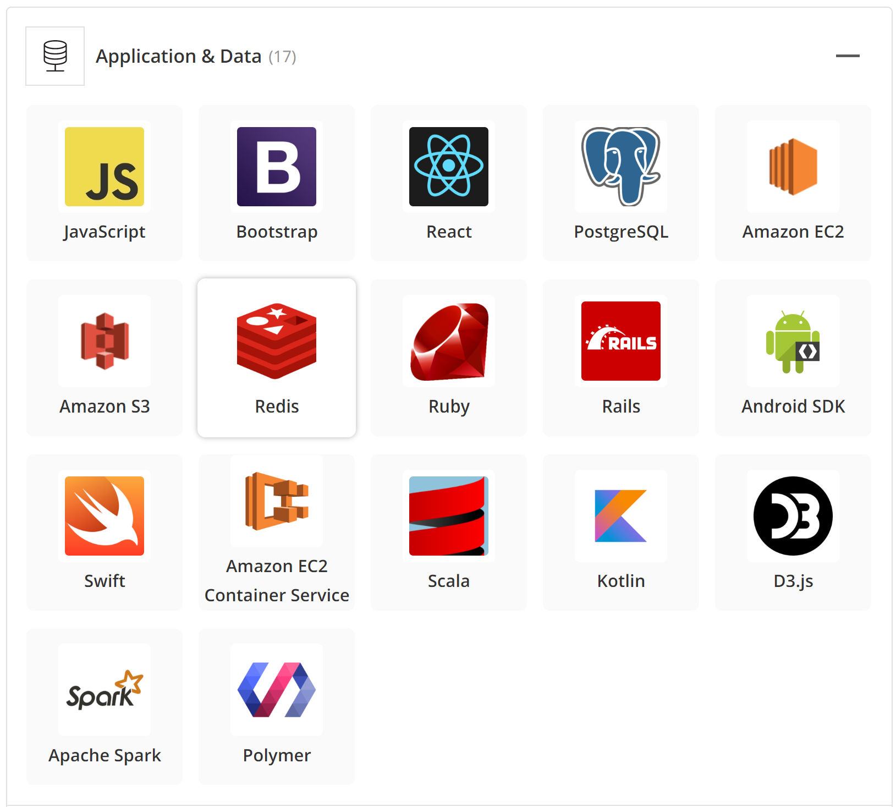
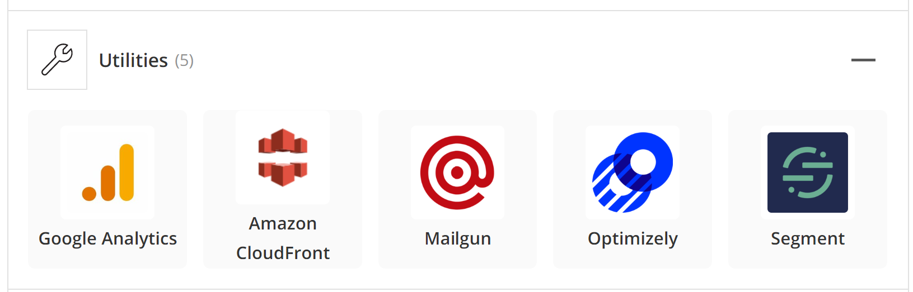
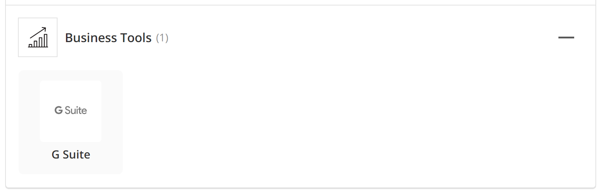
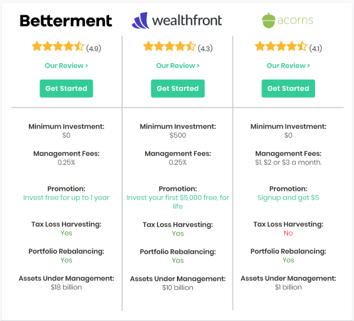

# ACORNS CASE STUDY


## ```Overview and Origin```
----


| |   **`Company Details`**  | |
| ----------- | ----------- | ----------- |
|Name |**`ACORNS Securities LLC`**| |
| || 
|Headquarters 	|Irvine, California
|CEO |	Noah Kerner
|Founders | Jeffrey James Cruttenden, Walter Wemple Cruttenden III 
|Domain	| Fintech - Robo Advisor
|URL	| [Website](www.acorns.com)
|Launched |	**2012**

----


### `What does Acrons do`

**Acorns** is a financial technology and financial services company for micro investing and robo advisory.


### `How does it work` 

When you spend money in a store or online, the Acorns app invests your spare change. If you spend `$8.90` in a store, it invests `$0.10` into the investment portfolio, which adds to your savings within the Acorns service.


### `Origin Story`  

A father-and-son team started Acorns. It was the son, Jeff Cruttenden’s idea. Since his dad [Walter Cruttenden] was in the financial industry, he had grown up being comfortable around investing. When Jeff was in college, he wondered why we make it so hard for Americans to invest when it’s so important to their well-being, and started thinking about how we could make it easy for people to invest.
Jeff came up with the idea of rounding up spending on purchases and investing the change. The idea behind it was that you’re already spending; if we can attach the process of investing to something that you’re already doing, and we can lower the risk thresholds, we can get a lot more people investing. And then, once they’re in, we slowly nudge them to save and invest more. Jeff worked with his dad and they came up with a prototype, and that was how Acorns was born. 

### `Origin of the Company Name`

His dad came up with the name. He was walking in the woods when he looked down and saw acorns on the ground. He thought, 
>”That’s what we’re doing. We’re planting an acorn, and over time it will become an oak tree.”

### `Services offered`

`Acorns Invest`
Basic account which automatically invests your `spare change` to your diversified portfolio.

`Acorns Later`
The easiest way to save for retirement. It recommends an IRA that's right for you.

`Acorns Spend`
Their all-digital checking account with retirement and investment accounts built-in, even comes equipped with a debit card.

***Acorns Found Money*** is the equivalent of an employer-match 401(k) plan. For every purchase you make with one of Acorn’s 200+ partners, they’ll contribute a dollar amount or a percentage of your purchase into your investment account. That’s free money. Used on top of a rewards credit card can double or triple your earning power.

`Acorns Grow`
Their online publication, Grow Magazine, hosts a suite of educational tools.

There are plenty of information in the `‘How-To’` section on:

- Budgeting
- Financial Planning
- Career
- Real Estate
- Taxes

### `Funding History`

| Date | Events | Details
| ----------- | ----------- | ----------- |
| 29-Feb-2012 | Founded | -
| 01-Jun-12|Seed| `$300,000`
| 01-Oct-13|Series A| `$2.5M`
| 26-Aug-14 | iOS Android App Launched | `-`
| 12-Mar-14 | Series B | `$6.2M`
| 15-Feb-15	| Series C | `$23M`
| 21-Apr-16	| Series D | `$35M`
| 20-Jul-17	| Series D | `$35M`
| 7-Nov-17 | Acquisition | `Vault`	
| 28-Jan-19	| Series E | `$105M` 
| 19-Aug-19	| Venture round | `Unknown`
| 1-Dec-19	| Venture round | `Unknown`
|`Total Funding`||`$207M`|


## `Business Activities`

----

### `What specific financial problem is the company or project trying to solve?`

It has been lauded by investors for ***finally*** getting millennials interested in investing.
As rightly said by Jennifer Barrett, Acorns' chief education officer
>"We’re going to be more and more responsible for our own finances. There are no pensions anymore. A lot of people can’t even depend on a 401(k). Social Security is shrinking. All these things are happening, but we’re not educating people on how to manage their money. I think it’s [***only***] 17 states that require personal finance to be part of their high school curriculum. That’s terrifying."

### `Acorns' intended customers and their market size`

Acorns appeals to millennials (ages 25-39 years ~ 70 million US population) and adults from Generation Z (ages 18 – 24 years ~30 Million US population). With the new Acorn Later feature they are also targeting Baby boomers (ages 52-70 years ~ 71 million US population) with retirement planning, a $40T market. 

It specifically targets people from the above categories, who may not have the time, the expertise or the resources to afford or to manage their finances. 

They have made clear of their target customers by introducing offers such as, students with a .edu email address can use Acorns Core for free, for up to four years. Or by their acquisition of Vault, which helps you automatically save for retirement whenever you’re paid. 

### `Its unfair advantage over the competitors`

They were the first one to offer the unique model of spare change micro-investing as a mobile-first platform, targeting Gen Z, and millennials. So, they have a first mover advantage. For the competitors associated high customer cost of switching is a barrier to entry. 
They are expanding internationally to other countries like Australia.
As they are well funded they are beginning to acquire smaller same niche players like Vault.

Any new player will only end up playing a catch up game because of the above reasons. And financially well placed competitors like Betterment etc. will have to pivot their business model to accommodate for micro-spending.

### `Technologies currently used and implemented`


Technology they are using is divided in four categories:

1.  **Application & Data:** Most of the technology used (listed below) is for cloud storage, smart phone app development and website application development.

    ###### ***Reference image www.stackshare.io***
2. **Utilities:**
Most technology used below is for improving customer analytics and experience: (google analytics) and AB testing (optimizely),  customer analytics (segment)

    ###### ***Reference image www.stackshare.io***
3. **Development Operations:**
 For coding, IDE, version control, online repository

    ###### ***Reference image www.stackshare.io***
4. **Business Tools:**

    ###### ***Reference image www.stackshare.io***


## `Landscape:`
---

### `Financial technology Domain Acorns belongs to`
Robo Advisory and micro investment domain.

### `Trends and innovations of this domain over the last 5-10 years`

- ***Niche Robo-Advising forces financial advisors to improve services:*** By 2020, up to $3.7 trillion in assets are expected to be managed with the support of robo-advisory services, Deloitte reports. That number will rise to more than $16 trillion by 2025.

- ***Cost benefits:*** Customers are enjoying cost benefits, especially when obtaining customized portfolios from Robo advisors. Which used to be done by traditional financial advisors with much higher fees

- ***More use of Artificial Intelligence:*** Enhanced analytics is another benefit of artificial intelligence, making data analysis a breeze and more accurate. Thus, delivering personalized financial solutions is now possible by analyzing the data of a customer through social media history and other data. 2020 will see more use of AI in Robo-advisory and other fintech-related processes and transactions. 

- ***Ease of access:*** With the evolution of smart phones investing app is easily accessable to most of the people.

### `Other major companies in this domain`
Betterment, Wealthfront and Stash

## `RESULTS`
---
### `What has been the business impact of this company so far?`
They have more than 4.5 million customers and 1 Billion AUM (Asset Under Management). They have been successful in enagaging younger crowd in the investment arena.

### `Core metrics that companies in this domain use to measure success? How is Acorns performing based on those metrics`

- ***Acquisition Metrics***
(*This indicates how many new customers you're managing to onboard.)* ***:*** 
There are currently 4.5 Million users as of Jan 2019. And over 100,000 users in retirement account as of Dec 2018.
They have more than $1 billion in assets under management (AUM). 
- ***Growth Metrics:*** Went from a few employees to more than 260 employees in four years, so they grown quite a bit.

- ***Revenue***
Exact revenue is unknown, however at the time of their series E funding the valuation of the company was `$860 Million`. Which is more than any of its competitors.

##### ***`Note:` KPIs such as how many app downloads, cost per acquisition and Retention Metrics is unknown.*** 

### `Acorns performance relative to its competitors`

Investors in the Series E round include Comcast’s venture capital arm and NBCUniversal, which is now its largest shareholder, along with Bain Capital Ventures, BlackRock and others.
The cash injections brings its valuation higher than those of micro-investing peers such as Betterment, Wealthfront and Stash.
It is a younger company compared to its peers in its domain and yet has a better valuation!


## `Recommendations`
---

### ` My recommendation of products and services they offer`

1. **Offer more asset classes and corresponding ETFs:**

-   ***Missing out on many customers:***
    In terms of investment Acorns only offers 7 Asset Classes and corresponding ETF’s that you can invest in based on the risk level derived.
    -   Large Company – VOO
    -   Small Company – VB
    -   Developed Market – VEA
    -   Emerging Market – VWO
    -   Real Estate – VNQ
    -   Corporate Bond – LQD
    -   Government Bond – SHY

    All though limited options of ETFs make it easy for a beginner/novice investor. However, they are missing out on people who would like to be treated as adults or those who graduate from this simplistic way of investment and would like to know more and/or like to have a bit control over their investments 

-  ***Tax Loss Harvesting:*** 
    TLH harvests the natural dips in the stock market as losses to weigh against your gains automatically. To reduce your “on paper” investment gains. With TLH you end up paying less tax on gains and over time the savings add up. If you invest more, the Acorns platform is reliable, but it won’t blow your mind. If you invest in the comparable risk level porfolios in other peer apps such as, Betterment, Wealthfront you will make more gains  because of the savings TLH provides.




###### ***Reference image www.listenmoneymatters.com***

2.  ***FDIC-insured up to $1 million***
    *There is a risk I will lose all my money if I invest through Acrons.* Though Acorns is also a member of the Securities Investor Protection Corporation (SIPC) which protects customers of its members for up to `$500,000`. However, the company is not FDIC insured except for Acorns Spend account holders, which means that if the business takes a big loss or the company goes under, then your money goes with it. Only users who are subscribed to Acorns Spend are protected for up to `$250,000` under the FDIC – Federal Deposit Insurance Corporation.


### `Why I think that offering the above products or service would benefit the company?`


-   More Asset class means more savings with Tax Loss Harvesting 
-   They could attract more intermediate and serious investors who perhaps just don’t have the time to invest and manage their portfolio. 
-   FDIC insured investment will bring more users onboard as it relieves them of the worry of a possibility of losing all their money. Also, today more than ever, when the market is so volatile, it would be important for them to reassure their existing subscribers for better retention.


### `Technologies the above additional product or service will utilize and Why?`

Their beauty is in their simplicity. However, they lack a full-powered robo-advisor, deploying algorithms and advanced software to manage a varied portfolio of investments. Acorns is more like robo-advisor meets automated saving tool meets app.

To compete with its competitors, to increase the AUM and retain the customers who would like to do more than just get started, over time, they would have to spend some effort in making it a robust true robo-advisor by deploying algorithmic method selection of investment among many more ETFs under each asset class. Which will help also help them in taking advantage of TLH.


----
## `References`
----

-   [The Rise of the Robo-advisor: How Fintech Is Disrupting Retirement](https://knowledge.wharton.upenn.edu/article/rise-robo-advisor-fintech-disrupting-retirement/)

-   [Robo-advisors: the next phase of fintech evolution](https://www.allerin.com/blog/robo-advisors-the-next-phase-of-fintech-evolution)

-   [The Best Robo-Advisors of 2020](https://smartasset.com/retirement/the-top-10-robo-advisors)

-   [Beware of spare change investments](https://www.policygenius.com/blog/beware-of-spare-change-investments/)

-   [Acorns Review - A Deeper look at the acrons app](https://echeck.org/acorns-review/)

-   [Fintech start-up Acorns valued at $860 million after latest funding round](https://www.cnbc.com/2019/01/28/fintech-start-up-acorns-valued-at-860-million-after-latest-funding-round.html)

-   [Acorns Review App 2020 – Is Acorns Worth It?](https://www.roboadvisorpros.com/acorns-review-app-acorns-worth-it/)

-   [Jennifer Barrett of Acorns with 5 Facts about Fintech](https://kwhs.wharton.upenn.edu/2019/01/acorns-jennifer-barrett-5-facts-fintech/)

- [Stack share - Acorns Technology](https://stackshare.io/companies/acorns)

-   [Wikipedia - Who are Millineals](https://en.wikipedia.org/wiki/Millennials)

-   [Acorns vs. Stash: Apps Compete for Novice Investors](https://www.nerdwallet.com/blog/investing/acorns-vs-stash/)

-   [Craft - Acorns Financials](https://craft.co/acorns)

-   [From Spare Change to Nest Egg: How Acorns Encourages Saving and Investing](https://knowledge.wharton.upenn.edu/article/spare-change-nest-egg-acorns-gets-folks-save-invest/)

-   [Betterment vs Wealthfront vs Acorns: Which Robo-Advisor Wins In 2020?](https://www.listenmoneymatters.com/acorns-vs-betterment-vs-wealthfront/)

-   [Crunchbase - Acorns Financials](https://www.crunchbase.com/organization/acorns-grow)

- [5 Fintech Trends to Watch in 2019](https://online.wharton.upenn.edu/uncategorized/5-fintech-trends-to-watch-in-2019/)


