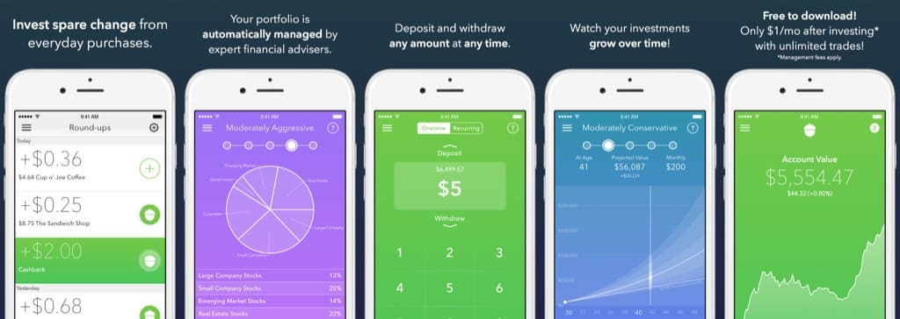

# How Acorn Works




## Key facts

The investing and savings start-up announces a $105 million Series E funding round on Monday, bringing Acorns’ valuation to $860 million.
Investors in the Series E round include Comcast’s venture capital arm and NBCUniversal, which is now its largest shareholder, along with Bain Capital Ventures, BlackRock and others.
The cash injections bring its valuation higher than those of micro-investing peers such as Betterment.


## Concept:

When you spend money in a store or online, the Acorns app invests your spare change. If you spend $8.90 in a store, it invests $0.10 into the investment portfolio, which adds to your savings within the Acorns service.

## How Do I Turn On Automatic Round-Ups?
In order to automatically invest your spare change, please click here and turn on the “Automatic” setting. Once automatic is set to on, future Round-Ups will be invested automatically once your Round-Ups reach at least $5.

## Is There A Risk I Will Lose All My Money?

Yes, there are three risks where you may lose your money. The first is that these sorts of investment schemes only work when the market is going up, when things start to drop, you are likely to start seeing losses.

Secondly, a good hacking group or a powerful virus may infect this company (and/or many others) and either draw money from your investments or steal your financial information. This is always a risk when you invest money with any company or institution.

Thirdly, the company is not FDIC insured, which means that if the business takes a big loss or the company goes under, then your money goes with it. If your bank goes under, then FDIC insurance helps ensure you do not lose everything. However, with Acorns, if the company goes down, then you can kiss goodbye to your money.

## Acorns – Cons

The Acorns is very unclear about how much they are rounding your account balance up to. You assume they are going to round up to the nearest dollar, but for all they tell you, they may be rounding up to the nearest hundred.
Seeing how much you have saved is going to tempt some people. Acorns should make it just a bit harder to see your balance so you do not see it as soon as you enter your app.
The little bit here and little bit there idea is great, but if you are already struggling, then you may have been better off by keeping the spare change in your account.

````
They should better explain the service on their website before having people sign up because their website only seems to paint half the picture.
````


## Acorns – Pros

Acorns offers a very passive way of saving, and even though such passive saving will not help you retire early, it will certainly make you richer in the long run.

If you like the “Playing it safe” investment strategy that Acorns uses, then you may add one-off payments to increase your savings, and you may set up recurring payments.

Spending your change makes it easy to forget that you are saving at all, which is ideal for some people who normally have trouble saving.

The fact that it takes a few days to withdraw the money means that people are not tempted to use the money to fund quick and frivolous purchases.

You only pay $1 per month for the service, and you pay 0.25% if you have a balance of more than $5000. There are no fees for deposits or withdrawals


``` 
The app is an investment platform so your funds are not FDIC insured and may lose money. However, Acorns is Securities Investor Protection Corporation (SIPC) insured insured for up to $500,000 meaning that if Acorns were to shut down you would be covered for a maximum of $500,000.

```


* Business Model
* ROI for a user
* What type of stock
* Risk factor (boom/bust) or just upward
* Charges
* Visually category investment
* Easy to take it
* My porfolio should not prefertial based on values abortion/gun rights
* Insurance or not
* Upgrade to professional Brokerage account.
* Start suggesting cost saving options too many subscriptions...or on books on coffee or gaming.
* People don't know the spending habits.
* Security concerns


